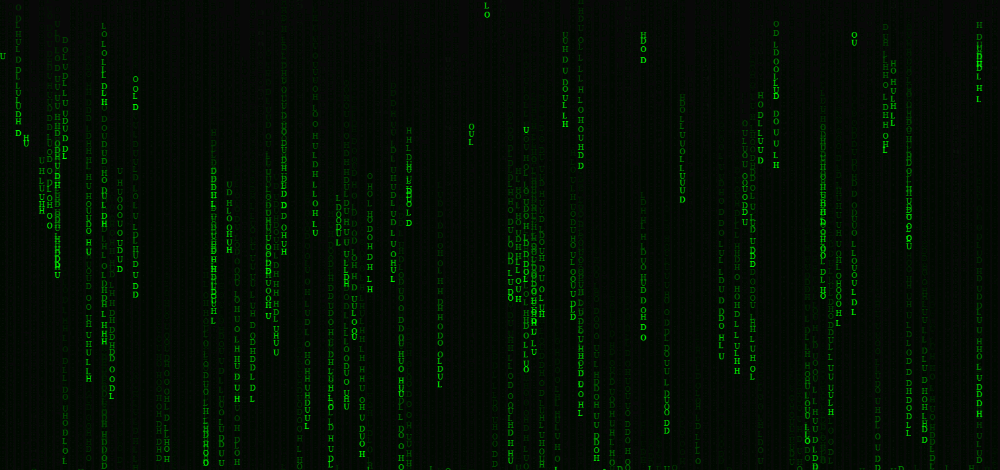

## matrix rain canvas ^[originally done by [gabrielsousadev](https://github.com/gabrielsousadev), I just redid their work in typescript.]
- create a cool canvas with matrix rain effect, can be used in varies places with your custom text.

`screenshot:`

